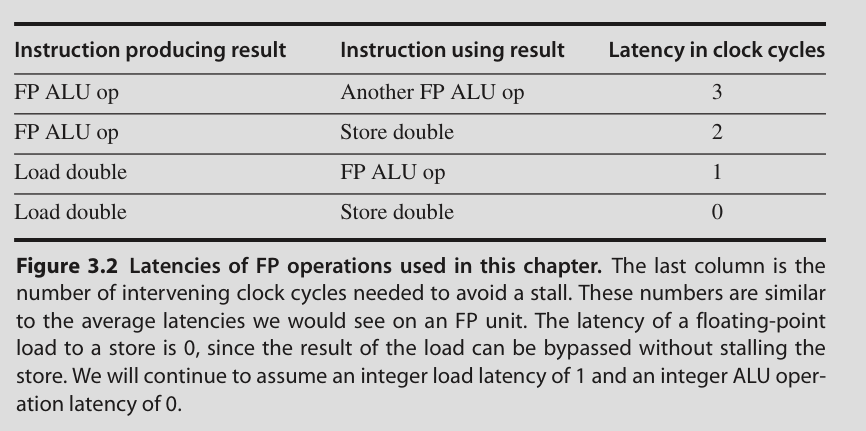
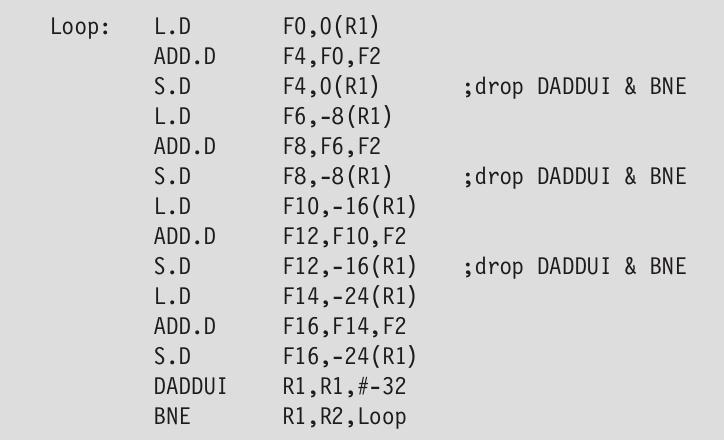
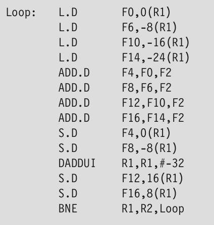
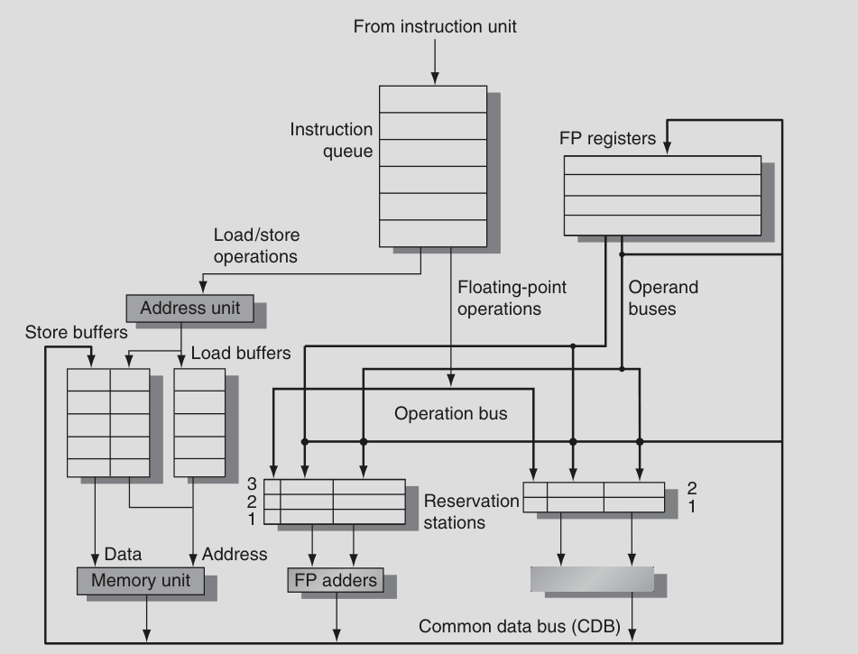

# Instruction Level Parallelism

- Goal is to maximize CPI

- Pipeline CPI = ideal pipeline CPI + Structural stalls + data hazard stalls + control stalls

Data dependence:

- True dependence: j needs results of i

Name dependence:

- Antidependence: j writes to a register that i reads

- Output dependence: i and j write to the same register/memory location

**Data hazard classification**:

- Read after Write (RAW)

- Write after Write (WAW)

- Write after Read (WAR): WAR doesn't occur since read happens early and write happens late

**Control dependence**:

- Instructions that are dependent on a branch can't be moved before the branch

- Instruction not dependent on a branch can't be moved aftet the branch

## Basic Pipeline Scheduling and Loop Unrolling

**Pipeline scheduling**: Separate dependent instruction from source instruction by pipeline latency of source instruction

**Loop unrolling**: Increase number of instructions relative to branch and overhead

Simply replicates the body multiple times while adjusting the loop termination code

Loop unrolling + scheduling can lead to optimization

In real programs, we don't know the upper bound of the loop. Suppose it is n, we unroll the loop to make k copies of the body. We generate a pair of loops, first one up to n%k and has the body of the original loop. Second up to n/k and has the unrolled body. 

Unrolled loop:

After scheduling for pipeline:

Limitations:

- Increased code size

- Compiler limitations

- Might lead to cache miss

- Register shortage

## Reducing Branch Costs with Advanced Branch Prediction

### Correlating Branch Predictors

**2 bit predictor scheme**: 

- Uses the recent behaviour of a branch to predict it's future behaviour

- Also look at recent behaviour of other branches for better accuracy

(m, n) predictor has 2^m x n x number of entries bits

### Tournament predictor

blah blah

## Overcoming Data Hazards with Dynamic Scheduling

Instruction scheduling but at runtime. Hardware rearranges the instructions

Advantages:

- Compiler doesn't need to know about microarchitecture

- Handles cases where dependencies are unknown at compile time

Disadvantage:

- Increase in hardware complexity

- Complicates exceptions

Implies:

- Out of order execution

- Out of order completion

Might lead to WAR and WAW hazards which did not exist before

To allow for out of order execution, ID stage is split into two stages:

1. Issue - Decode instructions, check for structural hazards

2. Read operands - Wait until no data hazards, then read operands

All instructions pass through the issue stage in order (in-order issue). However, they can be stalled or bypass each other in second stage (read operands)

## Tomasulo's Algorithm

- RAW hazards are avoided by executing an instruction only when its operands are available

- WAR and WAW hazards are avoided by **register renaming**

- Register renaming is handled by **reservation stations** which buffer the operands of instructions

Two important properties:

- Every functional unit determines whether an instructino can begin execution at that unit. Hazard detection and execution control are distributed

- Results are passed directly to functional units from reservation stations without going through registers through a **common data bus**. In pipelines with multiple execution units, multiple result buses are needed

Tomasulo's architecture

