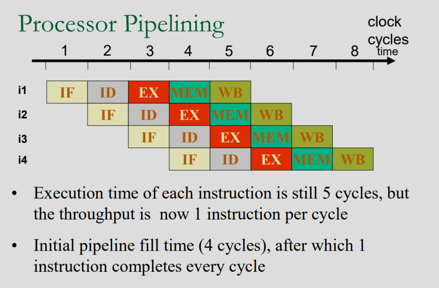
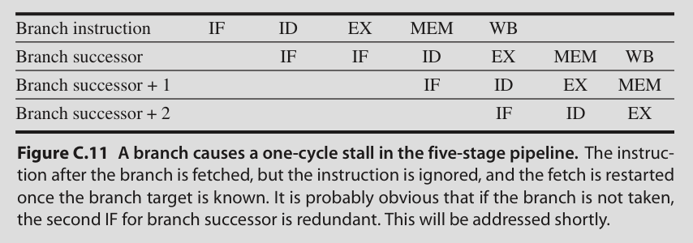
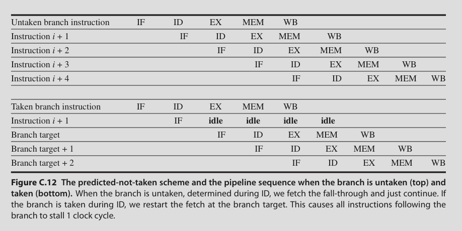
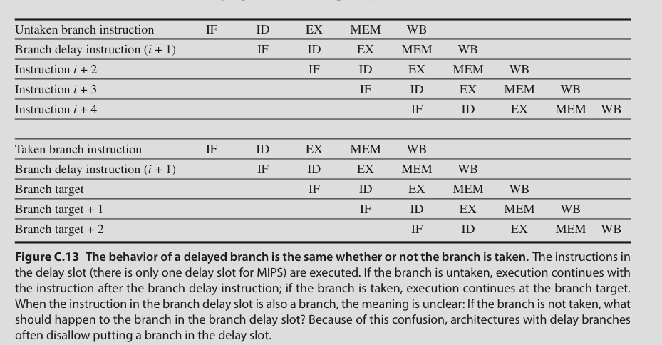

# Pipelining

## Five stages of execution

**1. Instruction Fetch**

- Send PC to memory

- Fetch the current instruction from memory

- Increment PC

**2. Instruction Decode**

- Decode the instruction

- Read source register values

- Do equality tests (eg: conditional branch)

**3. Execution**

ALU operates on the operands prepared in the previous cycle and performs one of the three functions depending on type

- Memory reference: ALU adds the base register and offset to form the effective address (eg: LW R1, 5(R3). Here it adds 5 to the value in R3)

- Register-Register ALU instruction: ALU performs the operation on values read from register

- Register-Immediate ALU instruction: ALU performs the operation on the value read from the register and the immediate value

We use a load-store architecture. So no instruction needs to both reading from memory and do ALU calculations. So these two are clubbed into a single cycle

**4. Memory Access**

- If the instruction is a load, memory is read using the effective address calculated in the previous cycle

- If it is a store, memory writes the data from the register at the effective address calculated in the previous cycle

**5. Write Back**

- Register-Register ALU instruction: Write the computed value into a register

- Load instruction: Write the loaded value into a register

Note that: We perform the register file reads in the second half of the cycle and the writes in the first half

## Pipeline speedup

$$
Pipeline\ speedup = \frac{time_{non-pipelined}}{time_{pipelined}}
$$

Considering 5 stage pipeline and n instructions

$$
speedup = \frac{5n}{4 + n} = 5\ as\ n \rightarrow \infty
$$

## Pipeline Hazards

### Structural Hazard

- When multiple instructions need to use the same resource at the same time

- Eg: IF and MEM both use memory at the same time

- Solved by designing main memory to handle 2 requests simultaneously. aka double ported memory

- Or by having a separate cache for instruction and data

### Data Hazard

- When an instruction depends on the result of a prior instruction that is still in the pipeline

Solutions:

- Interlock: Stall the progress of an instruction until the data is available

- Forward/bypass the result as soon as it is available to wherever it is needed

- Load delay slot: Loaded value might not be available right after load instruction

- Instruction scheduling: Reorder instructions so that dependent instructions are far enough apart. (Reorder must not change the meaning of the program)

**Static Instruction scheduing**: At complie time

**Dynamic Instruction scheduling**: At run time

#### Forwarding

- ALU result from both EX-MEM and MEM-WB pipeline registers is fed back to ALU input

- If it is detected that previous ALU operation has written to a register that is source for this instruction, the forwarded value is used instead of the value read from the register file

(Read tb for pipelining)

## Control Hazard

### Static Branch Prediction

A better approach is to assume the branch is not taken and continue execution

aka **predicted-not-taken** scheme

- After ID we know whether the branch is to be taken or not

No stall if branch is not taken

Stall of one cycle if branch is taken

### Branch Delay slot

The only difference being, i+1 instruction is seen through to completion irrespective of whether the branch is taken or not

- If the compiler puts an instruction that is needed irrespective of whether the branch is taken or not as the (i+1)th instruction, then there is no stall.

- If no such instruction is found compiler should insert an instruction that does nothing. Eg: ADD R0, R0, R0 (since R0 contains 0). 

- Some assembly languages also have a NOP instruction that can be used here
