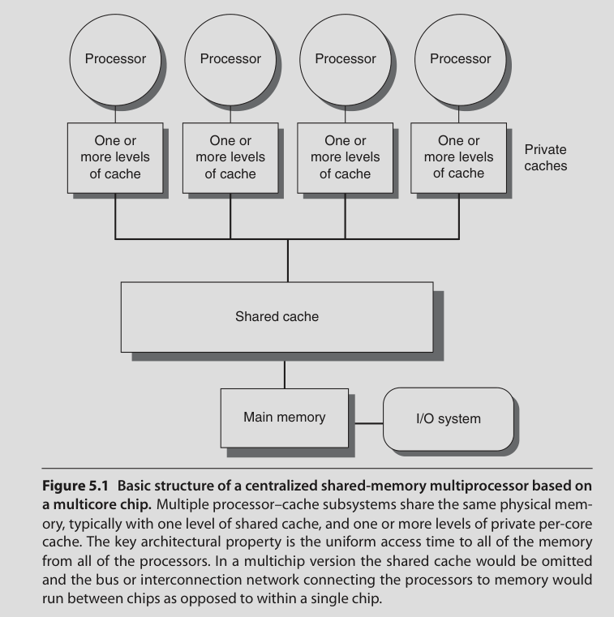
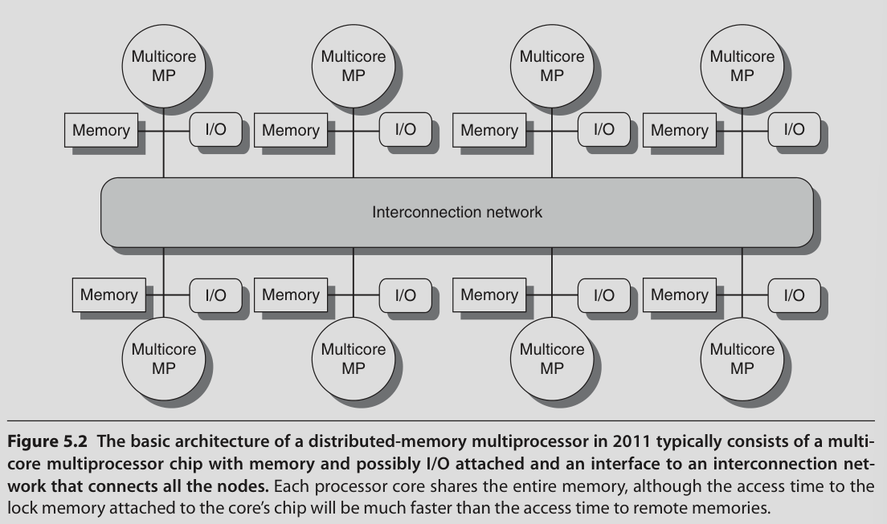
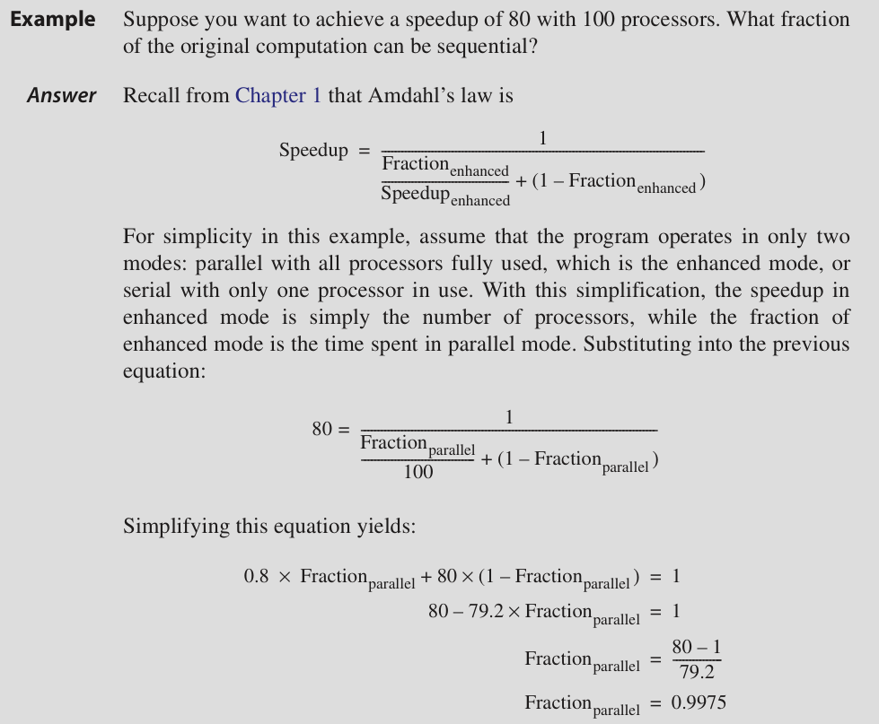
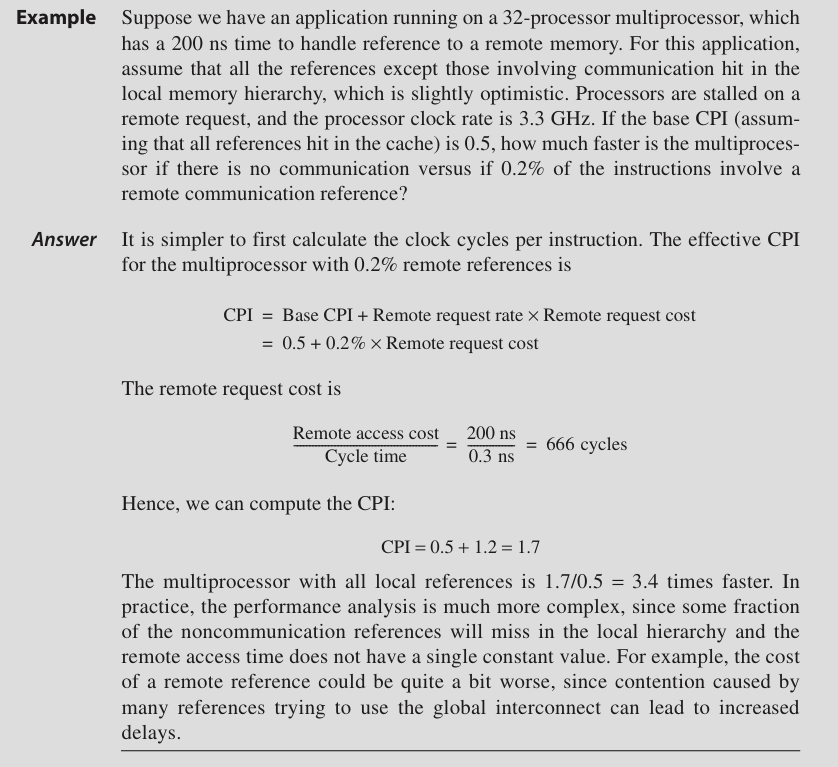

# Introduction

- There's a physical limit to single processor performance

- So: Multiprocessing

- TLP through MIMDs

Multiprocessor: Tightly coupled processors coordinated by a single OS and share memory through a shared address space (not necessarily single physical memory)

## Issues and Approach

- To take advantage of n processors we need atleast n threads

- Grain size: Amount of work done by one thread

## Classification

Shared memory multiprocessors fall into two classes:

### Symmetric multiprocessors

- aka centralized shared memory multiprocessors

- Usually used with small number of cores

- Memory is shared in a centralized fashion

- They provide Uniform Memory Access (UMA)

### Distributed Shared Memory

- Memory is distributed among processors

- High bandwidth interconnect

- Non Uniform Memory Access (NUMA)

- Communication between processors is more complex

In both cases shared address space. No message passing required between processors.

## Challenges

**Limited parallelism available in programs**

**Large latency of remote access**

Long communication delay

