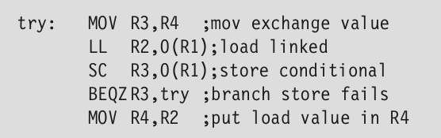
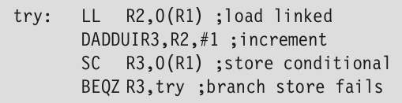
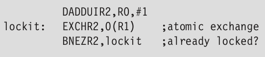
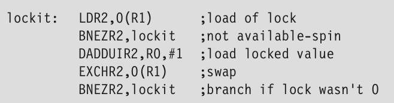
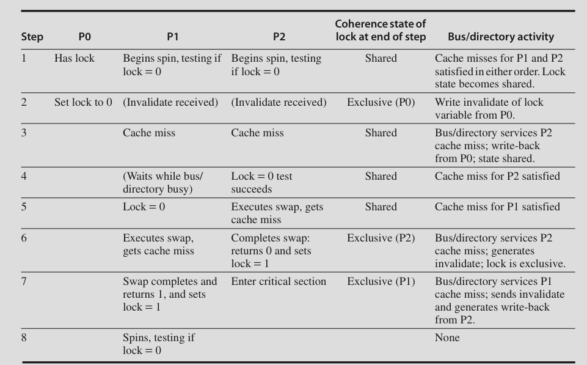
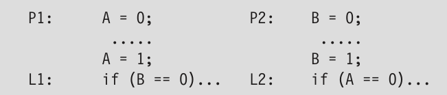

# Multiprocessors and Thread Level Parallelism

- There's a physical limit to single processor performance

- So: Multiprocessing

- TLP through MIMDs

Multiprocessor: Tightly coupled processors coordinated by a single OS and share memory through a shared address space (not necessarily single physical memory)

## Issues and Approach

- To take advantage of n processors we need atleast n threads

- Grain size: Amount of work done by one thread

## Classification

Shared memory multiprocessors fall into two classes:

### Symmetric multiprocessors

- aka centralized shared memory multiprocessors

- Usually used with small number of cores

- Memory is shared in a centralized fashion

- They provide Uniform Memory Access (UMA)

### Distributed Shared Memory

- Memory is distributed among processors

- High bandwidth interconnect

- Non Uniform Memory Access (NUMA)

- Communication between processors is more complex

In both cases shared address space. No message passing required between processors.

## Challenges

**Limited parallelism available in programs**

**Large latency of remote access**

Long communication delay

---

> Read from here for CIE 2

## Performance of Symmetric Shared-Memory Multiprocessors

- Several different phenomena combine to determine performance

- Overall cache performance is a combination of uniprocessor cache miss and traffic caused by communication

- Changing processor count, cache size, block size etc can affect these two components

**True sharing misses**:

- First write by a processor to a shared cache block causes an invalidation

- When another process attempts to read a modified word in that cache block, a miss occurs

- Both of these misses are classified as true sharing misses

**False sharing misses**:

- Occurs when there is a single valid bit per cache block

- A word is written into and that block is invalidated

- Later, another processor tries to read another word from that block

- A cache miss occurs because the entire block has been invalidated, despite that word not being overwritten

- This is called fasle sharing miss

- It depends on the size of the block

**Types of cache misses**:

- Instruction: Instruction not in cache

- Capacity/conflict: Cache is full and some blocks need to be evicted

- Compulsory: Data not in cache

- Coherence misses: true/false sharing misses

### Performance measurements of a commercial workload:

- Increasing the L3 cache size eliminates uniprocessor misses, but leaves the multiprocessor misses untouched

- This is due to true or false sharing misses

- Increasing processor count increases true sharing miss rate, which increases the "memory access cycles per instruction"

- Increasing block size decreases uniprocessor misses and true sharing misses, but increases false sharing misses. Weirdly, instruction miss rate is not affected. Instruction stream of certain workloads have low spatial locality apparently.

### Performance of the Multiprogramming and OS Workload

- We look at cache performance of a multiprogrammed workload as we change cache size and block size

- We do this for kernel and user processes separately

User processes execute 8 times as many instructions as kernel processes

But kernel processes are 5 times as likely to cause cache misses because:

- Larger code size
- Lack of locality
- Kernel initializes all the pages before allocating them to a user (they won't be in cache for the first time, so it has to read them from memory)
- Kernel processes share a lot of data (leading to more sharing misses)

Why is kernel behaving differently?

We look at compulsory, coherence and capacity misses

As cache size is increased:

- Only capacity misses reduce

- There is an increase in coherence misses, but coherence misses are a small fraction so it doesn't matter

- Compulsory misses stay the same

As block size is increased:

- Capacity misses are decreased

- Coherence misses almost stay the same (false sharing increases but true sharing decreases)

- More importantly, compulsory misses decrease by a lot

Buuuut..... as the block size increases, more data needs to be transferred for each cache miss (we need to read one full block). So even though number of misses drops, the total memory traffic increases as block size increases

All this shows that OS is a very demanding user of memory system

To improve this, we can make the OS more cache aware or use better programming environments

## Distributed Shared-Memory and Directory-Based Coherence

- Snooping protocol requires communication with all other caches on cache miss

- The fact that there isn't a shared data structure that tracks the state of all the caches is what makes snooping fast. But this fact is a drawback when it comes to scalability

- Multiprocessor environments demand a lot of memory bandwidth

- This can be improved by distributing the memory (this way there is a separation between local memory traffic and remote memory traffic)

- We should also eliminate the need to broadcast on every cache miss

Alternative to snooping protocol is **directory protocol**

- Directory keeps the state of every block that may be cached

- This includes: which caches have copies of that block, whether it is dirty, etc

- If there is a shared L3 cache, we can store this directory in L3

But this solution is not scalable. We should distribute the directory as well. But it should be done in a way that the coherence protocol easily knows where the directory entry for any block is present.

- The solution is to distribute the directory along with the memory

- Different coherence requests can go to different directories just as different memory requests go to different memories (we're talking about distributed memory here)

- This way we avoid broadcasting coherence requests (we only need to update one directory)

### Directory-Based Cache Coherence Protocol

Two operations need to be handled:

- A read miss

- A write to a shared cache block

In a simple protocol, three states for each block:

- **Shared**: One or more nodes have the block cached, and the value in memory is up to date

- **Uncached**: No node has a copy of the cache block

- **Modified**: Exactly one node has a copy of the cache block and it has written the block, so the memory copy is out of date. The processor is called the owner of the block

Along with the state, we also need to keep track of which nodes have a copy of that block. 

- We can use a bit vector for each block, where each bit indicates whether a given processor has a copy of that block (1 or 0)

- The bit vector also keeps track of the owner of the block in exclusive state (only one bit is set)

**Local node**: Where the request originates

**Home node**: The node where the memory location and the directory entry of an address reside

Local node may be the home node, but still we need to look at directory (there might be a newer updated copy in a **remote node**)

**Different types of messages may need to be send**

### An Example Directory Protocol

#### Cache Block State Diagram

This diagram illustrates the **state transition diagram** for an **individual cache block** in a directory-based coherence system. It
shows how the state of a cache block changes in response to **local processor
actions** (black text) and **requests or responses from the home directory** (gray text).

---

**States**

1. **Invalid**:
      The cache block is not present or valid in the cache.
2. **Shared (Read Only)**: The cache block is valid, but it is only readable. Multiple processors may hold copies in this state.
3. **Modified (Read/Write)**: The cache block is valid, writable, and exclusively held by this cache. It is not consistent with memory.

**Transitions**

The arrows show transitions between states triggered by actions (CPU requests or messages):

**From Invalid**

1. **CPU Read**:
- A read miss is sent to the directory to fetch the block.
- The state transitions to **Shared** (if the block is shared) or **Modified** (if only this cache needs it).
2. **CPU Write**:
- A write miss is sent to the directory.
- The cache block transitions to **Modified** after ownership is granted.

**From Shared**

1. **CPU Read Hit**:
- No state change occurs if the cache block is read again.
2. **CPU Write**:
- The cache sends a write miss message to the directory.

- The directory invalidates other sharers and upgrades the state to **Modified**.
3. **Invalidate**:
- If another processor writes to this block, the directory sends an invalidate message, and the state transitions to **Invalid**.

**From Modified**

1. **CPU Read/Write Hit**:
- No state change; the processor continues to access the block.
2. **Write Miss from Another Processor**:
- The cache writes back the data to memory and transitions to **Invalid** or
   **Shared** as needed.
3. **Fetch Invalidate**:
- If another processor requests ownership, the cache transitions to **Invalid** after writing back the block to memory.

#### Directory State Diagram

The states and transitions in this diagram are similar to the cache state transition, but they reflect actions performed by the directory controller, not the individual cache

**States of the Directory**

1. **Uncached**:
- The block is not cached by any processor. It only resides in memory.
- **Sharers = {}**: No processors currently hold the block.
2. **Shared (Read Only)**:
- The block is cached in **read-only mode** by one or more processors.
- **Sharers** contains a set of processors that hold the block in shared mode.
3. **Exclusive (Read/Write)**:
- The block is cached by a single processor in **write mode**, and no other processor holds a copy.
- **Sharers = {P}**, where **P** is the processor with exclusive ownership.

**Transitions Between States**

The transitions occur based on **read or write requests** and are managed by the directory.

**From Uncached**

1. **Read Miss**:
- A processor requests a read (read miss).
- The directory provides the block (data value reply) and adds the processor to the **Sharers** set.
- The state transitions to **Shared**.
2. **Write Miss**:
- A processor requests to write (write miss).
- The directory provides the block (data value reply) and grants exclusive ownership to the processor.
- The state transitions to **Exclusive**.

**From Shared**

1. **Read Miss**:
- Another processor requests a read.
- The directory replies with the block and adds the requesting processor to the **Sharers** set.
- The state remains **Shared**.
2. **Write Miss**:
- A processor requests to write.
- The directory sends invalidate messages to all processors in the **Sharers** set.
- Once all sharers have invalidated their copies, the directory grants exclusive ownership to the requesting processor.
- The state transitions to **Exclusive**.

**From Exclusive**

1. **Read Miss**:
- Another processor requests a read.
- The directory fetches the block from the exclusive owner and sends it to the requesting processor.
- The directory updates the **Sharers** set to include both processors.
- The state transitions to **Shared**.
2. **Write Miss**:
- Another processor requests to write.
- The directory fetches the block from the exclusive owner and invalidates it.
- It grants exclusive ownership to the requesting processor.
- The state remains **Exclusive**.

**Actions Taken by the Directory**

- **Data Value Reply**: The directory provides the requested block to a processor.
- **Fetch/Invalidate**: The directory fetches the block from a processor that holds it (in case of a miss) and invalidates other copies.
- **Update Sharers**: The directory keeps track of which processors hold the block.

## Synchronization: The Basics

- Built with user-level software that rely on hardware-supplied synchronization instructions

### Basic Hardware Primitives

- Ability to atomically read and modify a memory location

- **atomic exchange**: exchange a value in a register with a value in memory

- The exchange is indivisible and will be ordered by the write serialization mechanism

**test and set**: tests a value and sets it if the value passes the test. (similar to atomic exchage)

**fetch and increment**: returns the value of a memory location and atomically increments it

**challenge**: Must do a memory read and write in a single uninterruptible instruction. Hardware cannot allow any other operations between the read and the write, but it must also not deadlock

**alternative**: Have a pair of instructions, where the second instruction returns a value from which it can be deduced if the pair was executed as if they were atomic. **load linked (LL)** and **store conditional (SC)**

If the contents of the memory location specified by the LL are changed before the SC, the SC fails. If the processor does a context switch, then also SC fails.

SC returns 1 if it is successful. Else it returns 0.

If some other processor had modified the value, SC puts 0 in R3

**fetch and increment using LL SC**

### Implementing Locks using Coherence

**spin locks**: Locks that a processor continuously tries to acquire, spinning around a loop until it succeeds

Used when lock is expected to be held for a very short amount of time

If processor supports cache coherence, we can cache the locks using coherence mechanism

Caching is advantageous because:

- Faster from cache

- A processor that just acquired the lock is likely to acquire it again (temporal locality)

But the above code isn't good for this since all processors are trying to write to the lock

They should first read the lock then attempt to write to it

blah blah

## Models of Memory Consistency

- How consistent should the view of memory be

- **Sequential Consistency**: Result of an execution be the same as if the memory accesses executed by each processor were kept in order and the accesses among different processors were arbitrarily interleaved

- Then the if statements won't be executed in the previous examples as the assignments must be completed before the if statements

- Simplest way to implement: Delay the completion of a memory access until all the invalidations caused by that access are completed

- Or delay the next memory access until the previous one is completed

- delay the read of A or B (A == 0 or B == 0) until the previous write has been completed (A=1 or B=1)

- It reduces potential performance

### The Programmer's View

- Assume that programs are synchronized

We say that a data reference is ordered by a synchronization operation if in every possible execution: 

- The write of a variable by one processor is followed by a **synchronization operation**
- The access (read or write) of that same variable by another processor is preceded by a **synchronization operation** (e.g., acquiring the same lock or reading from the same barrier).

Cases where variables may be updated without synchronization are called **data races**

synchronized programs are **data-race-free**

Eg: Obtain lock before access and unlock after access

### Relaxed Consistency Models

- Allow reads and writes to complete out of order, but use synchronization operations to enforce ordering

- X -> Y: X should complete before Y

- Four orderings: R->W, R->R, W->R, W->W

1. Relaxing W->R yields **total store ordering**

2. Relaxing W->W yields **partial store order**

3. Relaxing R->W and R->R yields **weak ordering** and **release consistency**

By relaxing these orderings, the processor might obtain significant performance advantage. But it gets complicated.

Nowadays most multiprocessors support some sort of relaxed consistency model, with the expectation that the programmers would use standard synchronization libraries when needed
