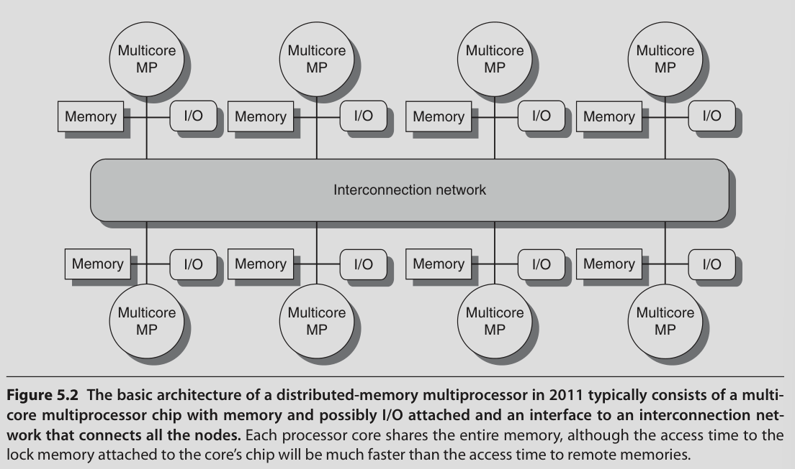

# Multiprocessors and Thread Level Parallelism

- There's a physical limit to single processor performance

- So: Multiprocessing

- TLP through MIMDs

Multiprocessor: Tightly coupled processors coordinated by a single OS and share memory through a shared address space (not necessarily single physical memory)

## Issues and Approach

- To take advantage of n processors we need atleast n threads

- Grain size: Amount of work done by one thread

## Classification

Shared memory multiprocessors fall into two classes:

### Symmetric multiprocessors

- aka centralized shared memory multiprocessors

- Usually used with small number of cores

- Memory is shared in a centralized fashion

- They provide Uniform Memory Access (UMA)

### Distributed Shared Memory

- Memory is distributed among processors

- High bandwidth interconnect

- Non Uniform Memory Access (NUMA)

- Communication between processors is more complex

In both cases shared address space. No message passing required between processors.

## Challenges

**Limited parallelism available in programs**

**Large latency of remote access**

Long communication delay

---

> Read from here for CIE 2

## Performance of Symmetric Shared-Memory Multiprocessors

- Several different phenomena combine to determine performance

- Overall cache performance is a combination of uniprocessor cache miss and traffic caused by communication

- Changing processor count, cache size, block size etc can affect these two components

**True sharing misses**:

- First write by a processor to a shared cache block causes an invalidation

- When another process attempts to read a modified word in that cache block, a miss occurs

- Both of these misses are classified as true sharing misses

**False sharing misses**:

- Occurs when there is a single valid bit per cache block

- A word is written into and that block is invalidated

- Later, another processor tries to read another word from that block

- A cache miss occurs because the entire block has been invalidated, despite that word not being overwritten

- This is called fasle sharing miss

- It depends on the size of the block

**Types of cache misses**:

- Instruction: Instruction not in cache

- Capacity/conflict: Cache is full and some blocks need to be evicted

- Compulsory: Data not in cache

- Coherence misses: true/false sharing misses

### Performance measurements of a commercial workload:

- Increasing the L3 cache size eliminates uniprocessor misses, but leaves the multiprocessor misses untouched

- This is due to true or false sharing misses

- Increasing processor count increases true sharing miss rate, which increases the "memory access cycles per instruction"

- Increasing block size decreases uniprocessor misses and true sharing misses, but increases false sharing misses. Weirdly, instruction miss rate is not affected. Instruction stream of certain workloads have low spatial locality apparently.

### Performance of the Multiprogramming and OS Workload

- We look at cache performance of a multiprogrammed workload as we change cache size and block size

- We do this for kernel and user processes separately

User processes execute 8 times as many instructions as kernel processes

But kernel processes are 5 times as likely to cause cache misses because:

- Larger code size
- Lack of locality
- Kernel initializes all the pages before allocating them to a user (they won't be in cache for the first time, so it has to read them from memory)
- Kernel processes share a lot of data (leading to more sharing misses)

Why is kernel behaving differently?

We look at compulsory, coherence and capacity misses

As cache size is increased:

- Only capacity misses reduce

- There is an increase in coherence misses, but coherence misses are a small fraction so it doesn't matter

- Compulsory misses stay the same

As block size is increased:

- Capacity misses are decreased

- Coherence misses almost stay the same (false sharing increases but true sharing decreases)

- More importantly, compulsory misses decrease by a lot

Buuuut..... as the block size increases, more data needs to be transferred for each cache miss (we need to read one full block). So even though number of misses drops, the total memory traffic increases as block size increases

All this shows that OS is a very demanding user of memory system

To improve this, we can make the OS more cache aware or use better programming environments

## Distributed Shared-Memory and Directory-Based Coherence

- Snooping protocol requires communication with all other caches on cache miss

- The fact that there isn't a shared data structure that tracks the state of all the caches is what makes snooping fast. But this fact is a drawback when it comes to scalability

- Multiprocessor environments demand a lot of memory bandwidth

- This can be improved by distributing the memory (this way there is a separation between local memory traffic and remote memory traffic)

- We should also eliminate the need to broadcast on every cache miss

Alternative to snooping protocol is **directory protocol**

- Directory keeps the state of every block that may be cached

- This includes: which caches have copies of that block, whether it is dirty, etc

- If there is a shared L3 cache, we can store this directory in L3

But this solution is not scalable. We should distribute the directory as well. But it should be done in a way that the coherence protocol easily knows where the directory entry for any block is present.

- The solution is to distribute the directory along with the memory

- Different coherence requests can go to different directories just as different memory requests go to different memories (we're talking about distributed memory here)

- This way we avoid broadcasting coherence requests (we only need to update one directory)

