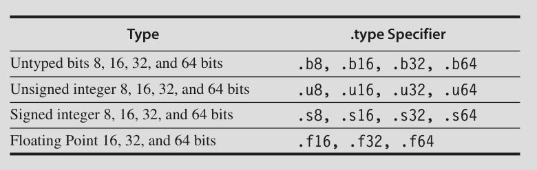

# Data Level Parallelism

## Introduction

Three variations: Vector architectures, multimedia SIMD instruction set extensions and GPUs

## Vector Architecture

- Grab sets of data elements scattered about memory, place them into large sequential register files, operate on data in those register files and disperse the results back into memory

- A single instruction operates on vectors of data

- Amortize memory loads and stores

### VMIPS

Components:

**Vector registers**

- VMIPS has 8 vector registers

- Each vector register holds 64 elements

- Each element is 64 bits wide

- Has enough ports for all vector functional units

- 16 read ports and 8 write ports

- Ports are connected to functional units by crossbar switches

**Vector functional units**

- Each unit is fully pipelined

- Can start new operation on every clock cycle

- A control unit detects hazards (structural and data)


**VMIPS Instruction Set**


### How Vector Processors Work

`Y = a x X + Y`

SAXPY (Single precision A X Plus Y) or DAXPY

**DAXPY loop**

virgin MIPS code (not imp)


CHAD VMIPS code (imp)


Differences:

- Only 6 instructions compared to nearly 600

- Loops can be **vectorized** when there are no dependencies between iterations

- In MIPS every ADD.D must wait for MUL.D and every S.D must wait for ADD.D. On a vector processor, each instruction will only stall for the first element in each vector. Subsequent elements flow smoothly down the pipeline

- This is called **chaining** of dependent operations

- Kind of similar to loop unrolling, but done on hardware

### Vector Execution Time

Three factors:

- Length of the vector

- Structural hazards

- Data dependencies

We assume one operation per clock cycle

So execution time is approximately equal to vector length

- **convoy**: Set of vector instructions that could potentially execute together

- Chaining allows a vector operation to start as soon as the individual elements of its vector operand becomes available (don't have to wait for the whole vector)

- Results from the first functional unit are forwarded to the second functional unit

- **chime**: Time taken to execute one convoy

- A vector sequence of m convoys execute in m chimes: approximately m x n clock cycles where n is the vector length

**Example**


- First convoy starts with LV. MULVS.D depends on LV, but they can be chained together and put in the same convoy

- Second LV has to be in a separate convoy (structural hazard with first LV). ADDVV.D can also go in this convoy

- SV has to be in a separate convoy (structural hazard with LV)

Three convoys:

```
1. LV    MULVS.D
2. LV    ADDVV.D
3. SV
```

Therefore it takes three chimes. There are 2 FLOPS per element (MUL and ADD)

```
Let v be the vector length
Number of clock cycles = 3 * v
Number of FLOPS = 2 * v

Clock cycles per FLOP = 3v/2v = 1.5
```

We are ignoring many overheads since the vector length is large

### Multiple Lanes: Beyond One Element per Clock Cycle


Instead of one element per clock cycle, four elements per clock cycle.

This way number of clock cycles for a chime goes from 64 to 16

Only makes sense if the vector length is large


### Vector-Length Registers: Handling Loops not Equal to 64

Example:

```c
for (i = 0; i < n; i++)
    Y[i] = a * X[i] + Y[i]
```

- We may not know vector length (n) at compile time

- **Vector-Length Register (VLR)** controls the length of any vector operation

- Cannot be greater than length of the vector registers: **Maximum Vector Length (MVL)**

What if vector length is greater than MVL??

**Strip Mining** is used

```c
low = 0
VL = (n % MVL) // initial VL is n%MVL
for (j = 0; j <= (n/MVL); j++) { //number of segments
    for (i = low; i < (low + VL); i++) //each element of segment
        Y[i] = a * X[i] + Y[i]
    low = low + VL; // Start of next segment
    VL = MVL; // After first loop, VL is set to MVL
}
```

Initial inner loop runs for `n%MVL` times: first segment

All other inner loops run for `MVL` times: all other segments

Each iteration of inner loop can be treated as one vector

### Vector Mask Registers: Handling IF Statements in Vector Loops

- if loop contains if statements it can't be vectorized as they introduce control hazards

Example:

```c
for (i = 0; i < 64; i++)
    if (X[i] != 0)
        X[i] = X[i] - Y[i]
```

- Cannot normally be vectorized

- But can be if inner loop could be run only for the iterations where X[i] != 0

- **vector-mask control** using **vector -mask register**

- When vector mask register is enabled, any vector instructions executed operate only on those vector elements, whose corresponding entries in the vector mask register are one

- Entries in the destination whose corresponding entry in the mask register are 0 are unaffected

- Clearing the vector mask sets it to all ones


- This transformation is called **if conversion**

- But even the non executed instances take time. So it still takes 64 clock cycles per chime

- Removing the if can still make it faster, even though sometimes it does useless work

### Memory Banks: Supplying Bandwitdh for Vector Load/Store Units

- Startup time: time to get the first word into register

- We assume 12 clock cycles

- To get one word per clock cycle, memory system should be able to handle this much

- Spread across multiple independent memory banks

Reasons:

- Multiple load/store per clock

- Non sequential access

- Memory sharing between multiple processors

**Numerical**:


### Stride: Handling Multidimensional Arrays in Vector Architectures

Consider matrix multiplication


- Matrices are linearized (row major in C)

- So column elements of D are not adjacent in memory

- Elements of D are separated by 100 words (row_size) ie 800 bytes

- **stride**: Distance separating elements to be gathered into a single register

- In this case stride of D = 100 double words

- Stride of B = 1 double word

- Stride can be stored in a general purpose register

- Then use LVWS (load vector with stride) instruction to fetch the vector

Supporting stride > 1 complicates the memory

A bank conflict and stall will occur if


### Gather-Scatter: Handing Sparse Matrices in Vector Architectures

In a sparse matrix, the elements are usually stored in some compacted form and accessed indirectly

Eg:


- K and M designate the non zero elements of A and C. They both must have same number of non zero elements (n of them)

- **gather scatter operations**: to support moving between a compressed representation and normal representation

- **gather operation** takes an **index vector** and fetches the vector whose elements are at the addresses given by adding a base vector to the offsets in index vector

- This gives a **dense vector**

- After being operated on, the sparse vector can be stored in expanded form by a **scatter** store

- LVI (load vector indexed): gather

- SVI (store vector indexed): scatter


- Indexed load stores can be pipelined. But they're still slower. Every element has an unrelated address so it can't be handled in groups

### Programming Vector Architectures

Whatever, give compiler hints or something

## SIMD Instruction Set Extensions for Multimedia

- media operations work on narrower data types than 32 bit

- By partitioning carry at certain spots, a 256 bit adder can add 32 8 bit numbers at once

Weaknesses:

- Number of data operands is fixed in the opcode, leading to many different opcodes

- Doesn't offer stride and gather-scatter

- Doesn't support mask register

But why are they still popular? 

- Easy to implement. Just minor changes to standard arithmetic unit

- Less state

- Less memory bandwidth

- Elements are next to each other, no page fault in the middle of loading a vector

### Roofline Visual Performance Model

**Arithmetic Intensity**: Floating point operations per byte of memory accessed

num_flops/num_bytes_accessed


Attainable GFLOPS/sec = min(peak memory BW x arithmetic intensity, peak floating point perf)

blah blah probably not important

## Graphics Processing Units

- Lowest level of parallelism in GPU: cuda **thread**

- GPU can support MIMD, SIMD, TLP and ILP

- Thousands of threads

- NVIDIA classifies CUDA as **Single Instruction Multiple Thread (SIMT)**

- Group of 32 threads: **Thread Block**

- Hardware that executes a block of threads: **multithreaded SIMD processor**

- `__device__` or `__global__` for GPU and `__host__` for the system processor

- `name<<<dimGrid, dimBlock>>>(...params...)`: Calling the function `name`

C code:


Cuda code:


Host: 

- Calls daxpy with 256 threads per blocks. Number of blocks needed is calcuated (minimum of 1)

Device:

- Calculates the index i based on blockIdx and threadIdx

- If it is less than n, it performs the operation

Every iteration of the loop is turned into an independent thread

Hardware handles parallel execution and thread management

### NVIDIA GPU Computational Structures

- NVIDIA is bad at naming things

- GPUs work well ony with DLP problems

- **Grid**: Code that runs on GPU. Consists of a set of **thread blocks**

**Some terms**:


- A thread block runs on a **multithreaded SIMD Processor** 

- This assignment is done by **Thread Block Scheduler**

**Simplified block diagram of a Multithreaded SIMD Processor**:


- Has many functional units
- SIMD processors are full processors with separate Program Counter
- GPU contains a collection of multithreaded SIMD processors that execute a grid of thread blocks

Two levels of hardware schedulers:

1. **Thread Block Scheduler**: Assigns Thread Blocks to Multithreaded SIMD Processors

2. **SIMD Thread Scheduler**: Within SIMD Processor. Schedules when threads should run
- Each thread is 32 wide: Each thread operates on 32 elements

- A thread block contains 16 threads

- A thread block operates on 32 \* 16 = 512 elements


SIMD Processor contains parallel lanes. Number depends on generation.

Eg: 16 physical lanes. Then each instruction in a thread would take 32/16 = 2 clock cycles (as threads consist of 32 elements)


- Since SIMD instructions are independent, the thread scheduler picks whatever thread of SIMD instructions is ready.

- The SIMD thread scheduler keeps track of upto 48 threads of SIMD instructions in a **scoreboard** to see which instruction is ready

- SIMD processor has 32000+ registers

- Each SIMD thread has 64 vector registers each having 32 elements each element being 32 bits wide.


### NVIDIA GPU Instruction Set Architecture

- **Parallel Thread Execution**: Stable instruction set for compilers and for compatibility across generations of GPUs

- PTX uses virtual registers. Compiler figures out how many physical vector registers an SIMD thread needs and an optimizer divides the available registers between SIMD threads

- Instrucitons are translated to internal form at load time

- Format: `opcode.type d, a, b, c;`

- d is destination and a, b and c are source operands

Types:



- All instructions can be predicated by 1 bit predicate regisers which can be set by `setp`

- `call`, `return`, `thread exit`, `branch` are control flow instructions

- Predicate in front of a branch statement gives conditional branch

- R0, R1.... are 32 bit registers (virtual)

- RD0, RD1 ... are 64 bit registers (virtual)


DAXPY in CUDA:


- One cuda thread handles one iteration of the loop

All data transfers are gather scatter in CUDA. If the addresses are sequential, GPUs have an address coalescing hardware that realises it and loads it efficiently


### Conditional Branching in GPUs

- Each SIMD thread has its own stack.

- A stack entry contains an identifier token, a target instruction address, and a target thread-active mask

- GPU hardware instructions have individual per-lane predication with 1 bit per lane

- PTX assember optimizes a simple IF/THEN/ELSE into predicated GPU instructions without any branch

- If control flow is more complex, it might result in predication and GPU branch

- **branch divergence**: When some lanes branch to target address, while others fall through

- When SIMD lane executes a synchronization marker, it converges.

- PTX assembler identifies loop branches and generates GPU branch instructions. When all the lanes have completed the loop, the thread converges

- setp evaluates a condition. The branch then depends on that predicate.

- If a predicate is set (without branch), SIMD lanes are enabled/disabled using the predicate register and the THEN part is executed.

- Then, a complement of the predicate is used and the ELSE part is executed

- IF statements can be nested: so a stack is used

- PTX assembler sets a "branch synchronization" marker on conditional branch instructions that push the current active mask onto the stack

- This is used to pop the mask after the branch and flip the mask bits before the ELSE portion

- If all the bits are 1, the ELSE part is skipped


Eg:


- A lane can either execute an instruction or sit idle. Two lanes cannot simultaneously execute different instructions


### NVIDIA GPU Memory Structures

**Private memory**: For each SIMD Lane

**Local memory**: Local to each SIMD processor. Shared by lanes. Dynamically allocated when thread block is scheduled

**GPU Memory**: Shared by the whole GPU and all thread blocks


- System host can only write to GPU memory

- Instead of lots of cache, GPUs try to hide memory latency in extensive multithreading

- Also does coalescing when multiple lanes access sequential memory


### Innovations in the Fermi GPU Architecture

- Each SIMD Processor has two thread schedulers and instruction dispatch units

- Two threads of SIMD instructions are scheduled every clock cycle


Other innovations:

- Fast double precisionfloating point arithmetic

- Caches for GPU memory

- 64 bit addressing and unified address space for all GPU memories

- Error correcting codes

- Faster context switch

- Faster atomic instructions


### Similarities and differences between vector architecture and GPUs

- SIMD processor is like a vector processor

- GPU is like a multicore machine

- GPU supports multithreading but vector processors dont

- VMIPS register files hold entire vectors; in GPU a vector would be distributed across registers of all SIMD lanes

- VMIPS has 8 vector registers each with 64 elements each (512 total). GPU thread has 64 registers with 32 elements each (2048 total)

- GPUs have way more lanes so GPU "chimes are shorter"


- Memory: In GPU all are gather scatter. GPU has implicit stride

- Vector architecture amortizes memory latency by pipelining. GPU hides it by multithreading

- Conditional branch: Mask register, predicate register

- Strip mining is more straightforward in GPU

- Control processor gives instructions etc etc, in GPU Thread Block scheduler assigns SIMD processors to thread blocks

- Scalar processor in vector. System processor in GPU. But have to transfer over PCIe for system processor


### Similarities and Differences between Multimedia SIMD and GPUs

blah blah blah not important


## Detecting and Enhancing Loop Level Parallelism

- loop-carried dependence: data dependence between loop iterations

Example:


It is possible to have loop carried dependence and still exhibit parallelism:


S1 depends on S2, but S2 does not depend on S1. 

No circular dependences. There is a partial ordering. But it must be transformed to conform to this partial ordering

Transformed loop:


Now this can be parallelized

Dependence exits if:

- There are two iteration indices j and k both within the limits of the loop

- Loop stores into an array element a\*j+ b and later fetches from that same array element when it is indexed by c\*k + d. i.e. a\*j+b = c\*k + d


**GCD test**:

If a dependence exists:

GCD (c, a) must divide (d - b)


But sometimes even if GCD test succeeds, dependence may not exist, as it doesn't consider loop bounds

- Determining whether a dependence actually exists is an NP complete problem

### Eliminating dependent computations

Turn dot product into a parallel part and a reduction

Reduction is not parallelizable but there's usually special hardware that supports it.

BLAH BLAH


