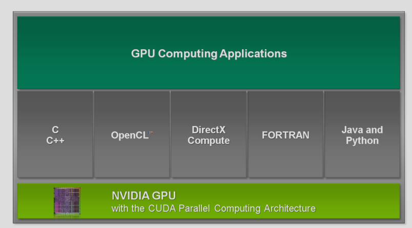
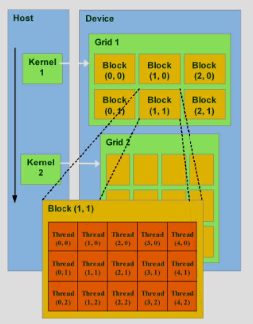
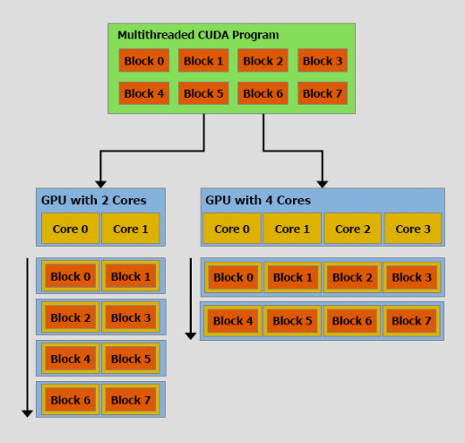
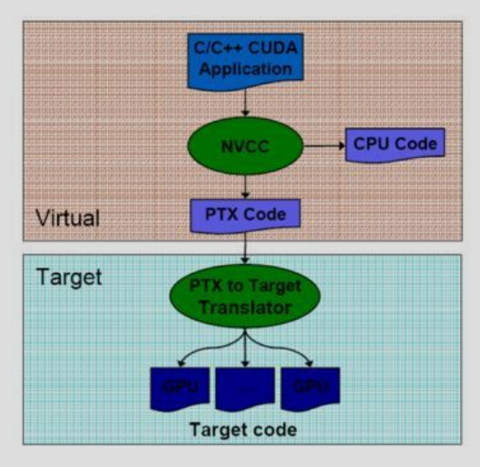

# Parallel Programming using Cuda

**Traditional computing**:

- Instructions are fetched from memory to CPU

- Run sequentially

**Parallel computing**:

- Simultaneous use of multiple compute resources to solve a compuational problem

**Flynn's Taxonomy**

- SISD

- SIMD

- MISD

- MIMD

## CUDA

- NVIDIA's general purpose parallel computing architecture

- Calculation intensive computing on a GPU

- It's an API (not a language)



### Cuda Structure

- Threads are grouped into thread blocks

- Blocks are grouped into a grid

- Grid is executed on the GPU as a kernel



### Scalability

- Blocks map to cores on the GPU



## Terms and Concepts

- **threadIdx**

- **blockIdx**

- **blockDim**

unique thread Id = `blockIdx * blockDim + threadIdx`

## NVCC Compiler

- Compiles C or PTX

- Compiles to PTX or binary (cubin object)



## Development

1. Allocate equal memory for host and device

2. Transfer data from host to device

3. Execute kernel to compute on data

4. Transfer data back to host

### Kernel Function Qualifiers

Decides where the function runs

- `__global__`: Executed on GPU, called from host

- `__host__`: Executed on host

- `__device__`: Executed on device. Can be called only from device

### Variable Type Qualifiers

Decides where the variable is stored

`__device__`: 

- Stored in device memory

- Shared by all the threads

`__shared__`:

- Stored in shared memory
- Shared by all threads in a thread block
- Not accessible to other blocks

`__constant__`:

- Read only memory

- Optimized for fast access

### Calling a kernel function

```c
myCudaFunc<<<numBlocks, numThreadsPerBlock>>>(...params...);
```

### GPU Memory Allocation

```c
int main(){
    int n = 1024;
    int numBytes = n * sizeof(int);
    int *ptr = 0;

    cudaMalloc((void **) &ptr, numBytes);
    cudaMemset(ptr, 0, numBytes);
    cudaFree(ptr);
}
```

### Memory Transfer

```c
cudaMemcpy(void *dst, void *src, size_t numBytes, enum cudaMemcpyKind direction);
```

- Blocks CPU until copy is complete and the function returns

- Doesn't start copying until previous CUDA calls complete

```c
enum cudaMemcpyKind {
    cudaMemcpyHostToDevice;
    cudaMemcpyDeviceToHost;
    cudaMemcpyDeviceToDevice;
}
```

## Matrix Multiplication

```c
#include<cuda_runtime.h>
#include<stdio.h>

__global__ void matrixMultiply(float *a, float *b, float *c, int n) {
    int row = blockIdx.y * blockDim.y + threadIdx.y;
    int col = blockIdx.x * blockDim.x + threadIdx.x;

    if (row < n && col < n) {
        float sum = 0;
        for (int i=0; i<n; i++)
            sum += a[row * n + i] * b[i * n + col]

        c[row * n + col] = sum;
    }
}

int main() {
    int n = 100;
    size_t size = n * n * sizeof(float);

    float *h_a = (float *)malloc(size);
    float *h_b = (float *)malloc(size);
    float *h_c = (float *)malloc(size);

    for (int i = 0; i < n * n; i++) {
        h_a[i] = 1.0;
        h_b[i] = 2.0;
    }

    float *d_a, *d_b, *d_c;
    cudaMalloc(&d_a, size);
    cudaMalloc(&d_b, size);
    cudaMalloc(&d_c, size);

    cudaMemcpy(d_a, h_a, size, cudaMemcpyHostToDevice);
    cudaMemcpy(d_b, h_b, size, cudaMemcpyHostToDevice);

    int threadsPerBlock = 16;
    int blocksPerGrid = (n + threadsPerBlock - 1) / threadsPerBlock;

    dim3 blockSize(threadsPerBlock, threadsPerBlock);
    dim3 gridSize(blocksPerGrid, blocksPerGrid);

    matrixMultiply<<<gridSize, blockSize>>>(d_a, d_b, d_c, n);

    cudaMemcpy(h_c, d_c, size, cudaMemcpyDeviceToHost);

    cudaFree(d_a);
    cudaFree(d_b);
    cudaFree(d_c);

    for (int i = 0; i < n; i++) {
        for (int j = 0; j < n; j++)
            printf("%f ", h_c[i * n + j]);
        printf("\n");
    }

    free(h_a);
    free(h_b);
    free(h_c);

    return 0;
}
```
