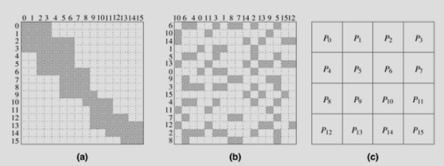

# Introduction to Parallel Programming

Parallel algorithm Design

- Identify portions that can be run concurrently

- Map concurrent pieces of work onto multiple processes

- Distribute data

- Manage access to shared data

- Synchronize at various stages

## Preliminaries

### Decomposition, Tasks and Dependency Graphs

**decomposition**: dividing a computation into smaller parts

**task**: main computation is divided into tasks. Regarded as indivisible

#### Dense matrix-vector multiplication

- In this case all tasks are independent

- But if they're dependent, we make: **task-dependency graph**

- It's a Directed Acyclic Graph which decides the relative order of execution

#### Database query processing

### Granularity, Concurrency, and Task-Interaction

**granularity**: size of the decomposed tasks

**fine-grained**: large number of small tasks

**coarse-grained**: small number of large tasks

**degree of concurrency**: Maximum number of tasks that can be executed simultaneously at any time. Eg: For the database example it's 4

**average degree of concurrency**: average number of tasks that can run concurrently over the entire execution

average degree of concurrency of:

- a: 2.33 (63/27)

- b: 1.88 (64/34)

Usually, as granularity increases, degree of concurrency increases

**critical path**: A feature of dependency graph that determines the average degree of concurrency

**critical path length**: sum of weights of nodes along the critical path, where weight is the amount of work associated with it

In the above graphs:

- a: 27

- b: 34

shorter critical path means higher concurrency

**task interaction**

**task-interaction graph**: shows interaction between tasks

#### Sparse matrix-vector multiplication

A sparse matrix x a dense vector

We make ith task the "owner" of A[i, \*] and b[i]

But others also need b[i], so this task is responsible for sending it to the others

### Processes and Mapping

**process**: abstract entity that executes a task

**mapping**: assigning tasks to processes

Good mapping:

- Independent tasks on different processes

- Execute tasks on the crititical path as soon as possible

- Minimise interactions

### Processes vs Processors

Process: abstraction

Processor: hardware

## Decomposition Techniques

### Recursive Decomposition

- Used for divide and conquer

- Eg: quick sort

#### Finding minimum in an array

**Serial algorithm**:

**Recursive algorithm**:

### Data Decomposition

Two step process:

- Partition the data

- Use the data partition to induce a partition of computation

**Partitioning output data**: Often each element of output an be calculated independently

#### Matrix Multiplication

#### Computing frequencies of itemsets in a transaction database

**Partitioning input**: Eg: sorting, finding max/min or sum of an array etc

**Partitioning both Input and Output data**

**Partitioning Intermediate data**

### Exploratory Decomposition

- Partition the search space into smaller parts and search each part concurrently

#### The 15 puzzle problem

- First few levels of configurations are generated serially until the search tree has sufficient number of leaf nodes.

- Now each node is assigned to a task to explore further until atleast one of them find a solution

- It's different from data decomposition because in data decomposition every process does work that is needed in the output. 

- In exploratory decomposition, when one process finds a solution, all others can be terminated.

### Speculative Decomposition

- Similar to branch prediction

- But does wasteful work

- A slightly less wasteful approach: Only most promising branch is taken up in parallel with the condition

#### Parallel Discrete Event Simulation

- At first glance it appears totally sequential

- But later components can assume an input and start evaluation

- When input becomes available, part of, or all the work required would've already been completed

- Different from exploratory in this way: In exploratory, even a serial algorithm would eventually do all the work that a parallel algorithm does

- In speculative: A parallel algorithm does extra work that a serial algorithm wouldn't do because the serial algorithm would know the correct input

### Hybrid Decompositions

## Characteristics of Tasks and Interactions

### Characteristics of Tasks

**1. Task Generation**:

- Static

- Dynamic

**2. Task size**

- Uniform

- Non uniform

- Knowledge of task size

- Size of data

### Characteristics of Inter-Task Interactions

**1. Static vs Dynamic** (can be known beforehand or not)

**2. Regular vs Irregular** (spatial structure)

**3. Read only vs Read write**

**4. One-way vs Two-way** (explicitly supplied or not)

> CIE 3 starts here

## Mapping Techniques for Load Balancing

- Minimize overheads

- Two sources of overheads
  
     - Inter task interaction
  
     - Some processes being idle

- Should try to minimize both

- But these two objectives are conflicting. Thus finding a good mapping is nontrivial

Mapping techniques are broadly classified into:

**Static mapping**:

- Tasks are distributed prior to execution

- Usually more suitable for statically generated tasks

- Easier to design and program

**Dynamic mapping**:

- Tasks are distributed during execution

- If tasks are generated dynamically then mapping also has to be dynamic

- If task size is unknown static mapping may be very imbalanced

- On the other hand, if data is large, dynamic mapping might involve moving the data around a lot

- In shared address space, dynamic mapping works even with large data

### Schemes for Static Mapping

#### Mappings Based on Data Partitioning

##### Block Distributions

- Assign uniform contiguous portions of the array to different processes

- Works very well when there is locality of interaction

- Eg: An n x n matrix can be partitioned into p parts such that each partition contains n/p consequtive rows (or columns)

- Can select multiple dimensions too

- In general, higher dimensional distributions allow us to use more processes

- Higher dimensional distributions may also reduce interactions

- Eg: Matrix multiplication distributing the resultant matrix along 1 or 2 dimensions

##### Cyclic and Block-Cyclic Distributions

- If the amount of work differs for different elements of a matrix, block distribution might lead to imbalances
- Eg: LU factorization
- Partition an array into many more blocks than the number of available processes
- Assign the partitions to processes in a round-robin manner

- Each process has tasks from all parts of the matrix, so overtime the imbalances average out

- If we make the block size to one row (or one element in 2d), it is called cyclic distribution

- Cyclic distribution is an extreme fine-grained block-cyclic distribution

##### Randomized Block Distribution

- If there are no patterns in the data, block cyclic might not lead to balanced distribution

- Eg: Shaded elements are nonzero whereas nonshaded are zero

- Here some processes like P12 don't get any work, whereas the diagonal processes do a lot of work

- Instead of assigning processes cyclically, we assign them randomly

- This leads to better load balancing

##### Graph Partitioning

- Eg: Simuation of physical phenomena

- Physical world is represented by a mesh of elements

- Computation usually requires data of a mesh point and its neighbouring mesh points

- In general, work done per mesh point is same

- But if nearby mesh points are not assigned to the same process it can lead to high interaction overhead

- Eg: Randomly assigning mesh points to processes:

- Consider a graph with mesh points as vertices and nearby mesh points have an edge between them

- The ideal distribution is one where each partition contains same number of vertices, and number of edges that cross partition boundaries is minimized. This is an NP-complete problem

- But reasonably good heuristics exist

- A good mapping assigns nearby mesh points to the same process

#### Mappings based on Task Partitioning

- Partitioning a task dependency graph

- Finding ideal solution for a general task dependency graph is an NP complete problem

- But specific situations have approximate solutions

- Eg: When task dependency graph is a binary tree (finding minimum in an array)

- There is some idling. Eg: when process 0 calculates for the root, all other processes are idle

- But less interaction as data dependent tasks are assigned to same process

- Another example: Sparse matrix multiplication

#### Hierarchical Mappings

- Tasks at higher level are further divided into smaller subtasks

### Schemes for Dynamic Mapping

- Necessary when static mapping may result in highly imbalanced distribution

- Or when task dependency graph itself is dynamic

- Classified as centralized or distributed

#### Centralized Schemes

- All executable tasks are maintained in a common central data structure or by a special process

- If special process: it is called master and others are called slaves

- When a processor has no work, it gets work from the central data structure or the master

- When a new task is generated it is added to this central data structure or reported to the master

- Easier to implement but limited scalability

- Eg: Sorting each row of a matrix. A central DS holds the rows that are left to be sorted

- A processor picks a row and sorts it. Called **self scheduling**

- **chunk scheduling**: A processor gets a group of tasks instead of just one (helps reduce overhead)

- Initially large chunk size, reduce the chunk size as program progresses

#### Distributed Schemes

- Processors exchange tasks at run time to balance work

- Processes can send work to each other

#### Suitability to parallel architectures

- Dynamic scheme requires movement of tasks

- So message passing is more effective

- Size of computation should be much higher than size of data (for data transfer to be worth it)

- In shared address space, tasks don't need to be moved around, but cache coherence still needs to be handled

## Methods for Containing Interaction Overheads

- Interaction overhead depends on volume of data exchanged, frequency of interactions and the spatial and temporal pattern of interactions

### Maximizing Data locality

- Processes may share input data

- Processes may also need data from each other

#### Minimize Volume of Data Exchange

- Akin to maximizing temporal locality

- Do as much as possible with the data that you already have

- Higher dimensional distribution often helps reduce the amount of non local data that needs to be accessed

- Another method is to store intermediate results within, and access the shared data only at the end to write the final result

#### Minimize Frequency of Interactions

- Access and use in large pieces, thus reducing number of interactions

- Akin to increasing spatial locality of data access

- Eg: In shared address space, each time a word is fetched, an entire cache line can be fetched

- In message passing systems, spatial locality leads to fewer message transfers

- Eg: In sparse matrix multiplication, first get all the input elements you need, then start calculation

### Minimizing Contention and Hot Spots

- Contention occurs when multiple processes use same resources simultaneously

- Eg: Memory block or interconnection link

- Eg: In matrix multiplication C = AB, all elements in the same row of C require the same row of A

- They can only access this memory one by one

- Instead change the order of evaluation so different memory addresses are needed simultaneously by different processes

### Overlapping Computations with Interactions

- Do computation when waiting for data

- Initiate interaction early enough that the result is available by the time it's needed

- Possible if interaction pattern is spatially and temporally static

- In dynamic mapping schemes, processes can request for more work when the current work is almost complete

- In message passing architecture: need hardware support like non-blocking message passing

- In shared address space, this is assisted by prefetching

### Replicating Data or Computations

- Keep a copy of shared read-only data on each process

- In shared address space paradigm, this is handled by caching by default

- Need to be done explicitly in message passing paradigm

- But drawback: Increases memory requirement

- Sometimes processes share intermediate results. It might be cheaper for each process to calculate this separately than rely on message passing

- Trading message passing for additional computation

### Using Optimized Collective Interaction Operations

- Eg: Broadcasting some data to all the processes

- Or adding up numbers each belonging to different processes (reduction)

- Use highly optimized implementations of these commonly appearing collective operations

### Overlapping Interactions with Other Interactions

- Eg: Broadcasting data from p0 to all the processes can be done like this

- But sometimes the naive way (b) can be adapted to increase the amount of overlap. Eg:

## Parallel Algorithm Models

### Data-Parallel model

- Tasks are statically mapped onto processes and each task performs similar operations on different data

- Called **data parallelism**

- Decomposition is based on data partitioning

- Can be implemented on both shared address space and message passing

- Message passing may lead to better locality

- Reduce interactions by:
  
     - Preserving locality in decomposition
  
     - Overlapping computation and interaction
  
     - Using collective interaction operations

- Eg: Matrix multiplication

### Task Graph Model

- Interrelations among tasks are used to promote locality and reduce interactions

- Called **task parallelism**

- Usually used when size of data is much larger than amount of computation

- Works better in shared address space

- Reduce interactions by:
  
     - Reduce volume of data
  
     - Reduce frequency of interactions
  
     - Map tasks based on interaction patterns

- Eg: Parallel quicksort

### Work Pool Model

- Dynamic mapping of tasks onto processes

- Any task may be performed by any process

- Mapping may be centralized or distributed

- Tasks may be soted in a list, priority queue, hash table or tree

- Work could be statically available or dynamically generated

- Can be used when amount of data is relatively small compared to amount of computation

- Adjust the granularity according to the tradeoff between load imbalance and overhead of accessing the work pool

- Eg: Chunk scheduling of for loops

### Master Slave model

- aka manager worker model

- Master generates and allocates work

- Work may be allocated statically or dynamically

- Work may need to be done in phases, and the master may need to synchronize all the slaves before moving on to the next phase

- Any worker can do any work without any desired premapping

- Can be generalized to hierarchical or multi-level manager-worker models

- Works well in both shared address space and message passing

- Ensure that master does not become a bottleneck. Adjust granularity accordingly

### Pipeline or Producer-Consumer model

- aka **stream parallelism**

- Data is passed on through a succession of processes

- Arrival of new data triggers execution of new task in each process

- Pipelines could be linear, multidimensional or graphlike (without cycles)

- Pipeline is a chain of producers and consumers

- Larger the granularity, the longer it takes to fill up the pipeline

- But too small of a granularity may increase interaction overheads

- Reduce interaction by overlapping interaction with compuation

### Hybrid models

- More than one model

- Could be hierarchical or sequential (in phases)

- Could be mixed as well
