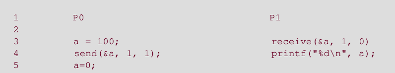
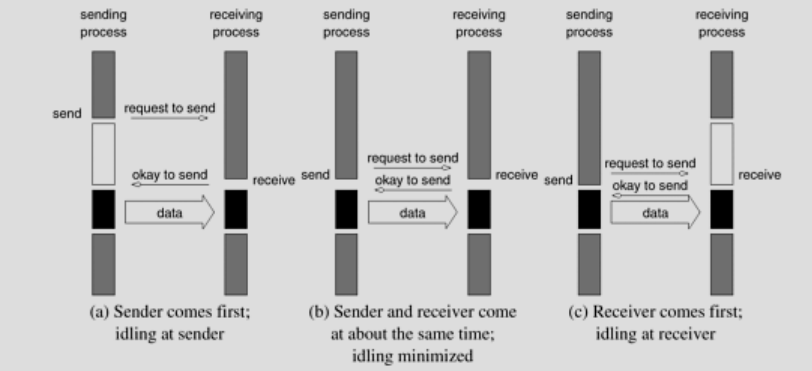
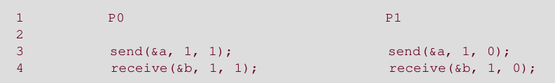
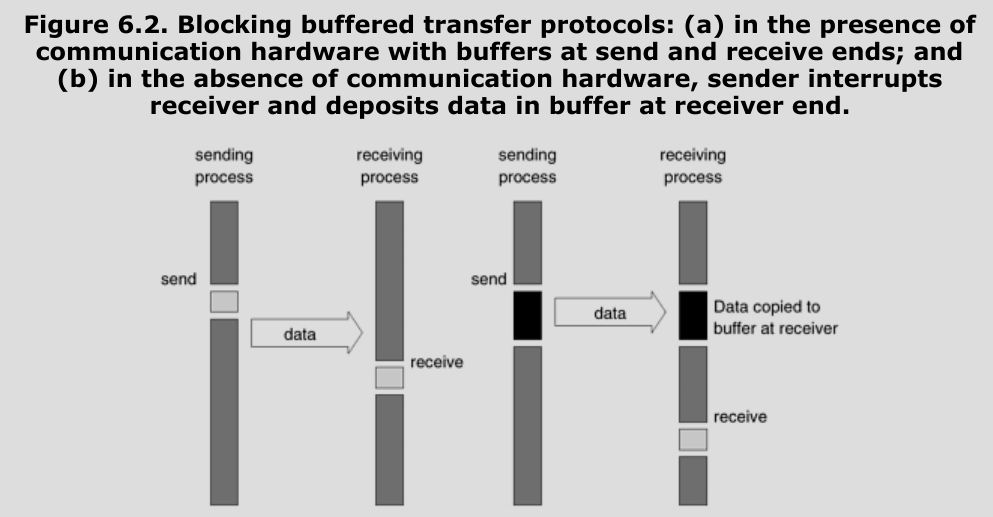
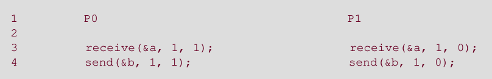
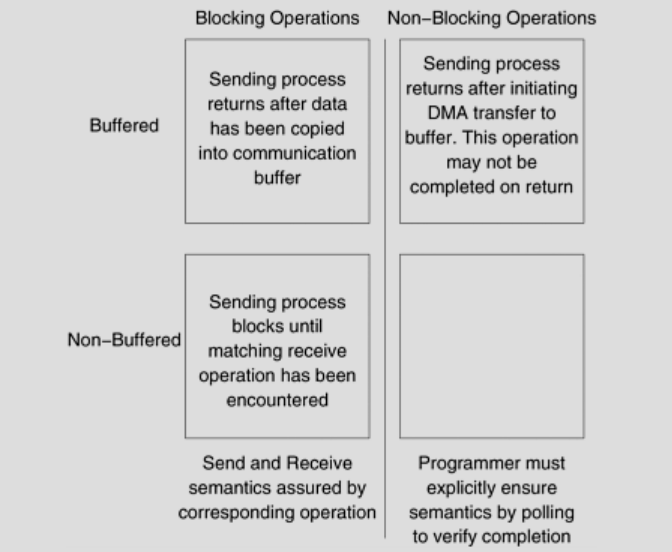
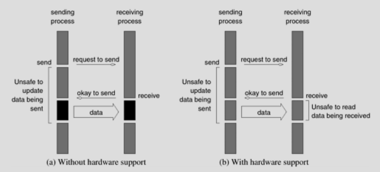
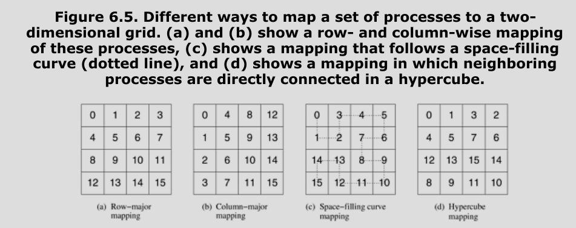

# Programming Using the Message Passing Paradigm

## Principles of Message Passing Programming

- Two attributes:
  
     - Assumes a partitioned address space
  
     - Supports only explicit parallelization

- p processes each with its own exclusive address space

- Implications:
  
     - Each data element must belong to one process
  
     - All interactions require cooperation of two processes

- Advantages:
  
     - Programmer is fully aware of the costs of interactions
  
     - Can be implemented on wide variety of hardware

- Hard to write code. But can be very efficient and scalable

**Structure of message passing programs**:

- Asynchronous or loosely synchronous

- Loosely synchronous: Interactions happen synchronously. But otherwise asynchronous

- **Single Program Multiple Data (SPMD)** approach

- Code executed by different processes is usually identical. But it doesn't mean they execute in lock step

## The Building Blocks: Send and Receive Operations

```c
send(void *sendbuf, int n_elems, int dest);
receive(void *recvbuf, int n_elems, int source);
```

Consider this example:



- If send isn't blocking and it supports DMA, and the send function returns before data is actually sent, P0 might end up sending 0 instead of 100.

- This shouldn't happen

### Blocking Message Passing Operations

- A simple solution to above problem

- Send returns only when it is semantically safe for it to do so

Two ways to do this:

#### Blocking Non-Buffered Send/Receive

- send operation doesn't return until a matching receive is encountered at the receiving process

- Involves a handshake between the two processes (request to send and okay to send)

- This may lead to a lot of idling as shown:



- This may even cause deadlock



- Both processes wait for each other forever

#### Blocking Buffered Send/Receive

- Buffers at the sending and receiving end

- Sender copies the data to buffer and continues executing

- Any value change in the sender doesn't affect the semantics of the program

- The value in the buffer is sent over network to the receiver (which is stored in receiver's buffer)

- When receiver calls receive, the value is read from the buffer if available



- Some overhead can be reduced by buffering only on one side. Eg: when sending, the sender interrupts the receiver and deposits the data in the receiver's buffer. There is no buffer at the sender.

- Also, buffers are finite. Need to block when buffer runs out

- It is still possible to write code that deadlocks even in this protocol because receive is always blocking



### Non-Blocking Message Passing Operations

- send/receive returns before it is semantically safe to do so

- But programmer must be careful in ensuring correctness

- `check-status` operation indicates whether the send/receive has completed or not

- Non blocking operations can be buffered or non buffered



- This protocol works as shown:



- Idle time can be used for computation

- With hadware support, communication overhead can be almost entirely masked by non-blocking operations

- But received data is unsafe to touch until receive is complete

- Libraries like MPI support both blocking and non-blocking

- Non-blocking is good for performance, but be careful not to touch unsafe data

## MPI: Message Passing Interface

- Every parallel computer was being shipped with its own Message Passing Library

- MPI was designed to be hardware agnostic

- MPI contains over 125 routines, but it is possible to write a fully functional message passing program using only 6 of them

- These are:

```c
MPI_Init();
MPI_Finalize();

MPI_Comm_size();
MPI_Comm_rank();

MPI_Send();
MPI_Recv();
```

### Starting and Terminating the MPI Library

`MPI_Init`: Initializes the MPI environment

`MPI_Finalize`: terminates the MPI environment and performs cleanup

```c
int MPI_Init(int *argc, char ***argv)
int MPI_Finalize()
```

Both return MPI_SUCCESS if successful. Or else return error

### Communicators

- **Communication domain**: Set of processes that are allowed to communicate with each other
- Information about communication domain is stored in `MPI_Comm`
- Each process can belong to many different (possibly overlapping) communication domains
- Communicator is used to define a set of processes that can communicate with each other
- Default communicator: `MPI_COMM_WORLD` involves all the processes

### Getting Information

```c
int MPI_Comm_size(MPI_Comm comm, int *size);
int MPI_Comm_rank(MPI_Comm comm, int *rank);
```

- size: Number of processes that belong to the communicator comm

- rank: unique id of each process in the communicator

- rank goes from 0 to size - 1

Hello world:

```c
#include <mpi.h>

int main(int argc, char *argv[]) {
  int npes, myrank;

  MPI_Init(&argc, &argv);
  MPI_Comm_size(MPI_COMM_WORLD, &npes);
  MPI_Comm_rank(MPI_COMM_WORLD, &myrank);
  printf("From process %d out of %d, Hello World!\n", myrank, npes);
  MPI_Finalize();
}
```

### Sending and Receiving Messages

```c
int MPI_Send(void *buf, int count, MPI_Datatype datatype, int dest, int tag, MPI_Comm comm);

int MPI_Recv(void *buf, int count, MPI_Datatype datatype, int source, int tag, MPI_Comm comm, MPI_Status *status);
```

- The functions are self explanatory

- MPI_Datatype includes all C datatypes and two more: MPI_BYTE and MPI_PACKED

- count is for number of entries and not number of bytes. This makes it portable across architectures

- Each message has a tag associated with it. This is useful for distinguishing different message types

- tag ranges from 0 to MPI_TAG_UB

- MPI_Recv can take wildcard arguments for source and tag: `MPI_ANY_SOURCE` and `MPI_ANY_TAG`

- The count passed to recv must be atleast as big as the sent message. This way, the receiver doesn't need to know the exact size of the message

- But if the sent message is bigger than the count passed to recv, it returns the error `MPI_ERR_TRUNCATE`

- After a message has been received, status is populated

```c
typedef struct MPI_Status {
    int MPI_SOURCE;
    int MPI_TAG;
    int MPI_ERROR;
};
```

- source and tag are useful when used with wildcard arguments

- `MPI_Get_count` gives the actual length of the received message.

```c
int MPI_Get_count(MPI_Status *status, MPI_Datatype datatype, int *count);
```

- MPI_Recv is blocking. It returns only after the data is received

- MPI allows for two different implementations for MPI_Send. One that blocks and one that copies to a buffer. Both are safe

#### Avoiding deadlock

```c
int a[10], b[10], myrank;
MPI_Status status;
...
MPI_Comm_rank(MPI_COMM_WORLD, &myrank);
if (myrank == 0) {
    MPI_Send(a, 10, MPI_INT, 1, 1, MPI_COMM_WORLD);
    MPI_Send(b, 10, MPI_INT, 1, 2, MPI_COMM_WORLD);
}
else if (myrank == 1) {
    MPI_Recv(b, 10, MPI_INT, 0, 2, MPI_COMM_WORLD);
    MPI_Recv(a, 10, MPI_INT, 0, 1, MPI_COMM_WORLD);
}
```

- If MPI_Send is implemented using buffering this code will run correctly

- If MPI_Send is implemented by blocking, this code deadlocks

- This code is not safe

- Can fix this by **matching the order** of send and receive

- Another case of deadlock: Process sends to itself

- Another example:

```c
int a[10], b[10], npes, myrank;
MPI_Status status;
...
MPI_Comm_size(MPI_COMM_WORLD, &npes);
MPI_Comm_rank(MPI_COMM_WORLD, &myrank);
MPI_Send(a, 10, MPI_INT, (myrank + 1) % npes, 1, MPI_COMM_WORLD);
MPI_Recv(b, 10, MPI_INT, (myrank - 1 + npes) % npes, 1, MPI_COMM_WORLD);
...
```

- Circular send receive

- If MPI_Send is implemented using buffering, this will work correctly

- But if send is blocking, this will deadlock

- This code is made safe by doing:

```c
int a[10], b[10], npes, myrank;
MPI_Status status;
...
MPI_Comm_size(MPI_COMM_WORLD, &npes);
MPI_Comm_rank(MPI_COMM_WORLD, &myrank);
if (myrank%2 == 1) {
    MPI_Send(a, 10, MPI_INT, (myrank+1)%npes, 1, MPI_COMM_WORLD);
    MPI_Recv(b, 10, MPI_INT, (myrank-1+npes)%npes, 1, MPI_COMM_WORLD);
}
else {
    MPI_Recv(b, 10, MPI_INT, (myrank-1+npes)%npes, 1, MPI_COMM_WORLD);
    MPI_Send(a, 10, MPI_INT, (myrank+1)%npes, 1, MPI_COMM_WORLD);
}
```

- Here processes are grouped into two groups

- Odd numbered processes send then receive

- Even numbered processes receive then send

#### Sending and Receiving Simultaneously

- `MPI_Sendrecv` both sends and receives

- Does not suffer from circular deadlock problems

```c
int MPI_Sendrecv (void *sendbuf, int sendcount,
    MPI_Datatype senddatatype, int dest, int sendtag,
    void *recvbuf, int recvcount, MPI_Datatype recvdatatype,
    int source, int recvtag, MPI_Comm comm,
    MPI_Status *status
);
```

- The above function needs two buffers for sending and receiving.

- If we want to send and replace the received message in the same buffer we can use

```c
int MPI_Sendrecv_replace(void *buf, int count,
    MPI_Datatype datatype, int dest, int sendtag,
    int source, int recvtag, MPI_Comm comm,
    MPI_Status *status
);
```

Here both send and recv datatypes should be same


## Topologies and Embedding

- MPI assumes a 1-d topology by default and numbers processes linearly

- But some parallel programs are naturally arranged in higher order topologies

- Need to map each MPI process to a process in taht higher-dimensional topology




- Goodness of a mapping is determined by the pattern of interaction among the processes in the higher-dimensional topology, connectivity of physical processors and the mapping of MPI processes to physical processors.

- We can't perform topology embeddings in an intelligent manner for different architectures

- It is better to let the library handle the embedding of a given topology

- MPI provides a set of routines to arrange processes in different topologies


### Creating and Using Cartesian Topologies

- MPI allows virtual process topologies of arbitrary connectivity in terms of a graph

- Each node corresponds to a process and two nodes are connected if they communicate with each other

- But most commonly grids are used (**Cartesian topology**)

- MPI provides specialized routines for multi-dimensional grids


```c
int MPI_Cart_create(MPI_Comm comm_old, int ndims, 
                    int *dims, int *periods, 
                    int reorder, MPI_Comm *comm_cart);
```

- All processes that belong to `comm_old` must call this function

- `ndims`: number of dimensions

- `dims`: array that specifies size along each dimension

- `periods`: array that specifies whether a dimension has wraparound connections or not (true or false)

- `reorder`: if false, processes have the same rank in the new communicator as old. if true, they may get new ranks.

**Process Naming**:

- Allows you to identify process by its coordinates rather than rank

- These functions translate from one to the other

```c
int MPI_Cart_rank(MPI_Comm comm_cart, int *coords, int *rank);

int MPI_Cart_coord(MPI_Comm comm_cart, int rank, int maxdims, int *coords);
```

(maxdims is the maxdims in the coords array that u pass. I'm guessing it exists to prevent any buffer overflow BS.)


```c
int MPI_Cart_shift(MPI_Comm comm_cart, int dir, int s_step, int *rank_source, int *rank_dest);
```

- This gives the rank of the source and the destination if you shift by `s_steps` steps along the `dir` dimension.

- If `periods[dir]` is true it wraps around.


## Overlapping Communication with Computation

### Non-Blocking Communication Operations

```c
int MPI_Isend(void *buf, int count, 
              MPI_Datatype datatype, int dest,
              int tag, MPI_Comm comm,
              MPI_Request *request);


int MPI_Irecv(void *buf, int count, 
              MPI_Datatype datatype, int source,
              int tag, MPI_Comm comm,
              MPI_Request *request);
```

- These functions return early

- To check whether the operation is complete:

```c
int MPI_Test(MPI_Request *request, int *flag, MPI_Status *status);

int MPI_Wait(MPI_Request *request, MPI_Status *status);
```

- `flag` is set to true if the operation is completed. Else false.

- If completed, request object is deallocated and set to `MPI_REQUEST_NULL`

- `status` object contains information if operation was completed


- To explicitly deallocate a request object:

```c
int MPI_Request_free(MPI_Request *request);
```

- But be careful when using this as we have no other way of checking if a non-blocking operation has completed

- Non-blocking send can be received by a blocking receive and vice versa


**Avoiding deadlock**:

```c
int a[10], b[10], myrank;
MPI_Status status;
MPI_Request requests[2];
...
MPI_Comm_rank(MPI_COMM_WORLD, &myrank);
if (myrank == 0) {
    MPI_Send(a, 10, MPI_INT, 1, 1, MPI_COMM_WORLD);
    MPI_Send(b, 10, MPI_INT, 1, 2, MPI_COMM_WORLD);
}
else if (myrank == 1) {
    MPI_Irecv(b, 10, MPI_INT, 0, 2, &requests[0], MPI_COMM_WORLD);
    MPI_Irecv(a, 10, MPI_INT, 0, 1, &requests[1], MPI_COMM_WORLD);
}
```


## Collective Communication and Computation Operations

- To use: All processes in the communication group must call


### Barrier

- Barrier synchronization

```c
int MPI_Barrier(MPI_Comm comm);
```


### Broadcast

```c
int MPI_Bcast(void *buf, int count, MPI_Datatype datatype,
              int source, MPI_Comm comm);
```


### Reduction

```c
int MPI_Reduce(void *sendbuf, void *recvbuf, int count, 
               MPI_Datatype datatype, MPI_Op op,
               int target, MPI_Comm comm);
```
