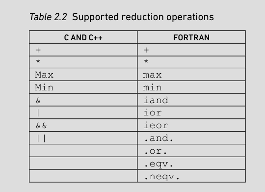

# Parallel Programming in OpenACC

- OpenACC is a high-level, directive-based programming model for C/C++ and Fortran.

- Programmers insert hints into their programs on how the code can be parallelized

## OpenACC Syntax

- OpenACC uses directives to annotate the program

- An OpenACC-capable compiler interprets these directives and generates parallel code

```c
#pragma acc <directive> [clause, clause....]
```

### Directives

- Directive is an instruction to the compiler

Three types:

**1. Compute directives**

- Marks a block of code that can be parallelized

- Includes: `parallel`, `kernels`, `routine` and `loop`

**2. Data management directives**

- Used to prevent unnecessary movement of data

- Specify data lifetimes on the accelerator that extend beyond compute constructs

- Includes: `data`, `update`, `cache`, `atomic`, `declare`, `enter data` and `exit data`

**3. Synchronization directives**

- `wait` directive

### Clauses

- Directives are augmented by clauses

Three categories

**1. Data handling**

- Eg: `default`, `private`, `firstprivate`, `copy`, `copyin`, `copyout`, `create`, `delete` and `deviceptr`

**2. Work distribution**

- Eg: `seq`, `auto`, `gang`, `worker`, `vector`, `tile`, `num_gangs`, `num_workers`, and `vector_length`

**3. Control flow**

- Eg: conditional (if or if_present), dependencies overridden (independent and reduction), task parallelism specified (async and wait)

### API Routines and Environment Variables

`#include "openacc.h"`

OpenAcc runtime routines can be used for:

- Device management: Querying and setting the used compute device type
- Initialization and shutdown of the OpenACC runtime
- Task parallelism: Testing and waiting for async launched work
- Memory management: Manually allocating, mapping and freeing memory on the compute device

## Compute Constructs

- Kernels and parallel directives

- Used to offload work to the compute device

### Kernels

- Tells the compiler the code can be run parallely

- Compiler decides whether it must run sequentially or parallely

- Compiler can even fuse loops

```c
#pragma acc kernels
{
  for(int j = 0; j < n; ++j) {
    for(int k = 0; k < m; ++k) {
      c[j][k] = a[j][k];
      a[j][k] = c[j][k] + b[j][k];
    }
  }
  for(int j = 0; j < n; ++j) {
    for(int k = 0; k < m; ++k) {
      d[j][k] = a[j][k] – 5;
    }
  }
}
```

- Can be converted into:

```c
#pragma acc kernels
for(int j = 0; j < n; ++j) {
  for(int k = 0; k < m; ++k) {
    c[j][k] = a[j][k];
    a[j][k] = c[j][k] + b[j][k];
    d[j][k] = a[j][k] – 5;
  }
}
```

- Compiler may or may not do it

### Parallel

- Programmer has to spell out what to parallelize

### Loop

- Can be used inside both parallel and kernels

- If placed inside `parallel`, it tells compiler that the loop iterations are independent

- If placed inside `kernels`, it tells the compiler that the loop iterations are independent, if the compiler cannot determine this at compile time

- Can use `seq` to execute in a serial manner

```c
void foo( int *a, int *b, n ) {
  #pragma acc parallel
  #pragma acc loop
    for(int j = 0; j < n; ++j) {
        a[j] += b[j];
      } 
}
void bar( int *a; int *b, n) {
  #pragma acc parallel
  #pragma acc loop gang worker vector
    for(int j = 0; j < n; ++j) {
        a[j] += b[j];
    }
}
```

- Here foo lets the compiler choose what levels of parallelism to use
- bar explicitly tells the compiler to use all three levels of parallelism

### Routine

- Used in function definitions and declarations
- Three ways in which function can be modified with the `routine` directive

```c
#pragma acc routine
extern void foo(int *a, int *b, int n);


#pragma acc routine(foo)


#pragma acc routine
void foo(int *a, int *b, int n) {
#pragma acc loop gang
  for(int j = 0; j < n; ++j) {
      a[j] += b[j];
  }
}
```

```c
#pragma acc routine vector device_type(nvidia) gang bind(foo_nvidia)
void foo(int *a, int *b, int n);


#pragma acc routine nohost
void foo_nvidia(int *a, int *b, int n) {
#pragma acc loop gang
  for(int j = 0; j < n; ++j) {
      a[j] += b[j];
  }
}
```

First directive:

- This routine can exploit vector level parallelism on all targets.
- But when compiled for target=nvidia, it can also exploit gang level parallelism, and all calls to `foo()` are replaced with calls to `foo_nvidia()`

Second directive:

- nohost: Generate code for the device but not for the host

## The Data Environment

- Device has a disjoint memory space from the main program

- Requires data movement between host and the device

- The following variables are predermined to be `private`:
  
     - Loop control variables
  
     - Variables declared inside a C block
  
     - Variables declared inside procedures

- Scalar variables used in parallel regions but not listed in data clauses are predetermined as `firstprivate`. Private variable but value is first copied

### Data Directives

Structured data region:

```c
#pragma acc data copy(a)
{
    // Use a
}
```

- Here data lifetime both begins at { and ends at }

Unstructured data region:

- Begin-end pair that need not be in the same scope

```c
void foo(int *array, int n) {
#pragma acc enter data copyin(array[0:n])
}

void bar(int *array, int n) {
#pragma acc exit data copyout(array[0:n])
}
```

### Data Clauses

- **Create Clause**:  
  
     - Establishes data lifetime for objects on the device.  
     - Allocates memory if not already present; updates reference count.  

- **Present Clause**:  
  
     - Ensures data is already available on the device.  
     - Useful for avoiding unnecessary data transfers, especially in libraries.  

- **Copy Clause**:  
  
     - Combines `present` and `create` clauses.  
     - Copies data from host to device at the start of the region.  
     - Copies data back to host and frees memory if reference count reaches zero.  

- **Copyin Clause**:  
  
     - Similar to `copy` but does not copy data back to the host at the end.  
     - Releases memory only if the reference count goes to zero.  

- **Copyout Clause**:  
  
     - Similar to `copy` but does not copy data to the device at the start.  
     - Copies data back to the host at the end if the reference count reaches zero.  

- **Delete Clause**:  
  
     - Removes objects from the device’s data environment.  
     - Forces reference count to zero and releases memory.  
     - Dangerous if misused, as it can lead to unintended data loss.  

- **Deviceptr Clause**:  
  
     - Indicates that a pointer contains a device-resident address.  
     - Allows external control of data placement while using OpenACC for computation.  

### The Cache Directive

- Moves data to faster memory (e.g., cache) for performance optimization.  

- **Example**:  
  
  ```cpp
  #pragma acc loop  
  for(int j = 0; j < m; ++j) {  
      #pragma acc cache(b[j])  
      b[j] = b[j] * c;  
  }  
  ```

- Informs the compiler about data access patterns in loops.  

- Data movement has a cost, but reuse in the loop can justify it.

- Caching cost is reduced if the data is read-only.  

### Partial Data Transfers

- **Dynamic Arrays**: Compiler cannot determine size at compile time if memory is allocated via `malloc`.  
- **Partial Array Transfers**: Programmers can manually specify which parts of an array to transfer.  

```cpp
#pragma acc data copy(a[0:n])  
```

- `n` is the number of elements, not end index
- **Use Cases**:  
     - Dynamically allocated arrays.  
     - Arrays larger than device memory.  
- Programmers must ensure compute regions only access transferred parts to avoid undefined behavior.  

## Kernels vs Parallel Loops

- Using parallel on its own is useless. It will run the same code on many threads at once and will not speed up, nor produce correct results

- Must combine it with a loop directive

```c
#pragma acc parallel loop
for(int i=0; i<N; i++){
  for(int j=0; j<M; j++){
    for(int k=0; k<P; k++){
        particles[i][j][k] = particles[i][j][k] * 2;
    }
  }
}
```

- If there are multiple loops (not nested) in parallel, there is no guarantee that the first loop will finish before the second. But kernels guarantees this

Eg:

```c
#pragma acc parallel{
  #pragma acc loop
  for(int i=0; i<1000; i++){
      a[i] = b[i];
  }
  #pragma acc loop
  for(int i=0; i<1000; i++){
    b[i] = b[i]*2;
    c[i] = b[i]+a[i];
  }
}
```

- The above code is not guaranteed to be correct as second loop could start before the first loop has finished

## Three Levels of Parallelism

- gang, worker, and vector

- Can be applied in the loop directive

- Affects how loops and loop iterations are distributed to hardware components

- What they actually translate to depends on the hardware that you're running on

- Not necessary to specify. If not specified, compiler will attempt a mapping based on what it knows about your code and the hardware

### Gang, Worker, and Vector Clauses

- **Gangs**:
  
     - Groups of workers that can operate independently.
  
     - No synchronization between different gangs.
  
     - Workers within the same gang can synchronize.

- **Workers**:
  
     - Threads within a gang.
  
     - Specify how threads are mapped to hardware.
  
     - Intermediate level between gangs (groups of threads) and vector parallelism.  

- **Vector Parallelism**: 
  
     - Finest granularity. Individual instruction operating on multiple data units.  
  
     - Similar to SIMD (Single Instruction, Multiple Data) on CPUs or warps on NVIDIA GPUs.  
  
     - Defined by a vector length, specifying the number of data units processed per instruction.  

### Mapping Parallelism to Hardware

- Eg in NVIDIA (not necessarily always):
  
     - Gangs map to thread blocks
  
     - Workers to warps
  
     - Vector to threads

- Specify size: `num_gangs()`, `num_workers()`, and `vector_length()`

- But this is optional

## Other Loop Constructs

### Loop Collapse

- Treat a whole nest of loops as a single loop space

```c
#pragma acc parallel loop collapse(3)
for(int i=0; i<8; i++){
  for(int j=0; j<8; j++){
    for(int k=0; k<8; k++){
        . . .
    }
  }
}
```

- Size of the loops must be computable and shouldn't change during the loop

### Independent Clause

Eg:

```c
!$acc kernels
!$acc loop
do i = 1, 512
  do j = 1, 1024
    local_index = (((i-1)*1024)+j
    halo_data(local_index) = particle_data(j,i)
  enddo
enddo
!$acc end kernels
```

- Compiler might think there's dependency here as `local_index`  is calculated using i - 1
- So it might produce sequential code
- So add `independent` clause to the loop directive to tell the compiler that you guarantee that the loop iterations are independent
- Only applicable to `kernels` directive
- In `parallel` directive, the compiler thinks all loops are independent by default unless you explicitly mention `seq`

### seq and auto Clauses

**seq**:

- Some loops seem parallelizable but have hidden dependencies.
- Compilers may wrongly parallelize loops with `kernels`.
- `parallel` forces full region parallelization, even if unsafe.
- `seq` prevents parallelization (cannot be used with gang/worker/vector).
- Example: `#pragma acc loop seq` prevents parallelization.

**auto**:

- `auto` lets compiler choose parallelism levels.
- `auto` is default in `kernels` 
- `auto` doesn't ensure independence; may need `independent`
- `auto` enables compiler checks in `parallel` regions

### Reduction Clause

```c
total = 0;
for(i=0;i<100;i++){    
    total += data[i];
}
```

- Not parallelizable because total is updated in every iteration

- `reduction` can be used to make each thread keep a local total, and at the end they're all added together

- Within `parallel`: Can use for the whole `parallel` region or on a `loop` directive

- Within `kernels`: Can only be applied for `loop` directives

```c
total = 0;
#pragma acc parallel loop reduction(+:total)
for(i=0; i<100; i++){
    total = total + data[i];
}
```




## Common Characteristics of Architectures

- Devices need to support atleast one of gang, worker, or vector parallelism support.
- OpenACC usually does **Computation offloading**: run intensive workloads on accelerators. Main program execution by host.
- But some compilers (e.g., PGI) can also target multicore CPUs.
- Performance analysis requires host-device execution correlation.
- Host measurements are fine-grained; accelerator data is coarser (kernel start/end, transfers).
- Depends on device-specific API to measure


## Compiling OpenACC Code

- Normal compiler: Just ignores OpenACC directives

- Need compiler with OpenACC support

```bash
pgcc –acc –ta=nvidia:kepler –Minfo=accel prog.c –o prog
```


